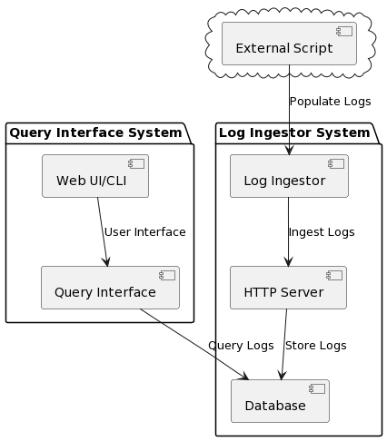
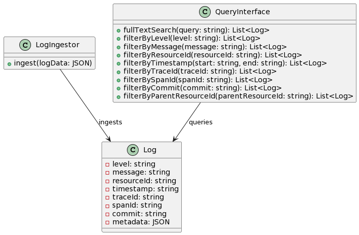
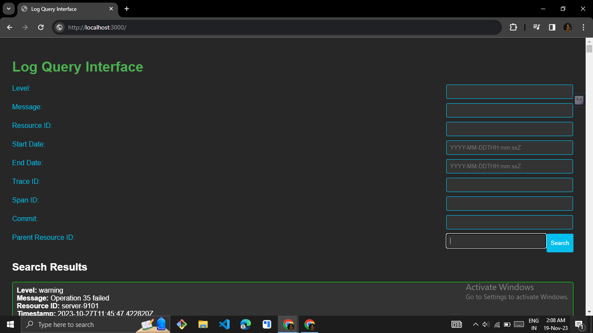
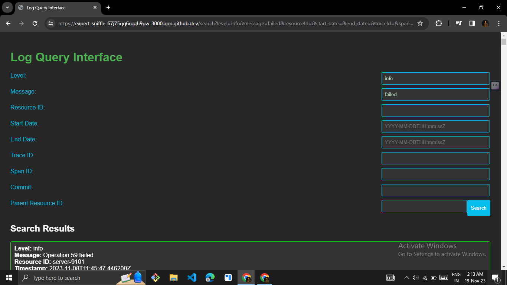
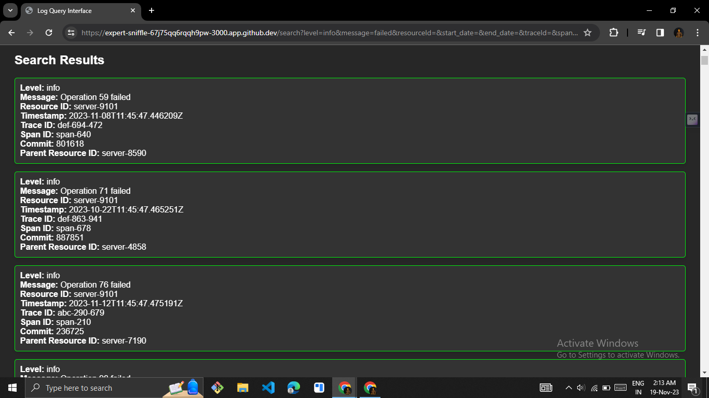

# Log Ingestor and Query Interface

## Overview

This project implements a Log Ingestor and Query Interface for efficiently handling and searching log data. The system allows logs to be ingested over HTTP and provides a user-friendly interface for querying logs based on various parameters.
Owner of the Repo-
name-yash Rajput
email-yashrajput02.scoe.comp@gmail.com.

## Table of Contents

- [Prerequisites](#prerequisites)
- [Installation and configurations](#installation)
- [System overview](#system-overview)
- [Usage](#usage)
- [Run using Docker](#Run-Using-Docker)
- [Features](#features)
- [Optional: Video/Presentation](#optional-videopresentation)

## Prerequisites of system

- Python
- Flask

## Installation

1. Clone the repository:
 ```bash
   https://github.com/dyte-submissions/november-2023-hiring-Yashrajput7232.git
   ```

2. Install the libraires by the following command
  ```bash 
   pip install -r requirements.txt
   ```
3. Navigate into app directory
    ```bash
       cd app
    ```

4. Configure MongoDB:

    (I have connected this application with my dummny MongoDb database you can use it too.but if you want to use your own database then follow the following commands)
    Create a MongoDB Atlas account.
    Replace username and password in app.py with your MongoDB credentials.
    Update the MongoDB connection string in app.py.


## system-overview




## Usage

make sure all the insatllation steps are completed

1. Once you are in app directory run folloeing command
    ```bash
    python main.py
    ```
    the flask app will start 
2. Open the browser and typre 
    ```bash
    http://localhost:3000/
3. To Inject the log you can use curl command 
    ```bash
        curl -X POST -H "Content-Type: application/json" -d '{
    "level": "error",
    "message": "Failed to connect to DB",
    "resourceId": "server-1234",
    "timestamp": "2023-09-15T08:00:00Z",
    "traceId": "abc-xyz-123",
    "spanId": "span-456",
    "commit": "5e5342f",
    "metadata": {
        "parentResourceId": "server-0987"
    }
    }' http://localhost:3000/ingest
    ```
    or you can use the ingestor.py file
    it is a python script which injest logs 

    first be in the directory where the injest.py file is there.

    ```bash
    python injest.py
    ```

3. Now a search page 
    

4. Now query accordingly you will get the results below
     
     
    
## Run-Using-Docker

1. Pull the image using command
    ```bash
        docker pull yash7232/log-query-manager5:latest
    ```
2. Run the conatiner suing the command 
    ``` bash 
        docker run -p 3000:3000 yash7232/log-query-manager5:latest
    ```

## features 

   1. Log ingestion over HTTP.
   2. Real-time log searching.
   3. Full-text search with regular expressions.
   4. Search filters based on log parameters.
   5. Search within specific date ranges.
   6. Scalability: Adaptability to increasing volumes of logs/queries.(Dockerized the appliction)
   7. Usability: Intuitive, user-friendly interface.


   


